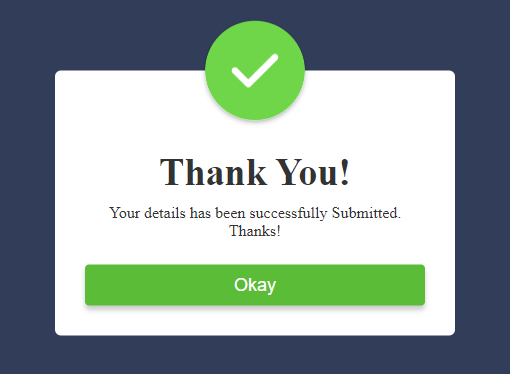

# Popup Notification Example



This is a simple example of creating a popup notification on a website using HTML, CSS, and JavaScript. The popup displays a welcome message and provides a "Okay" button to dismiss it.

## Usage

1. Clone the repository.

```bash
git clone https://github.com/username/repository.git
